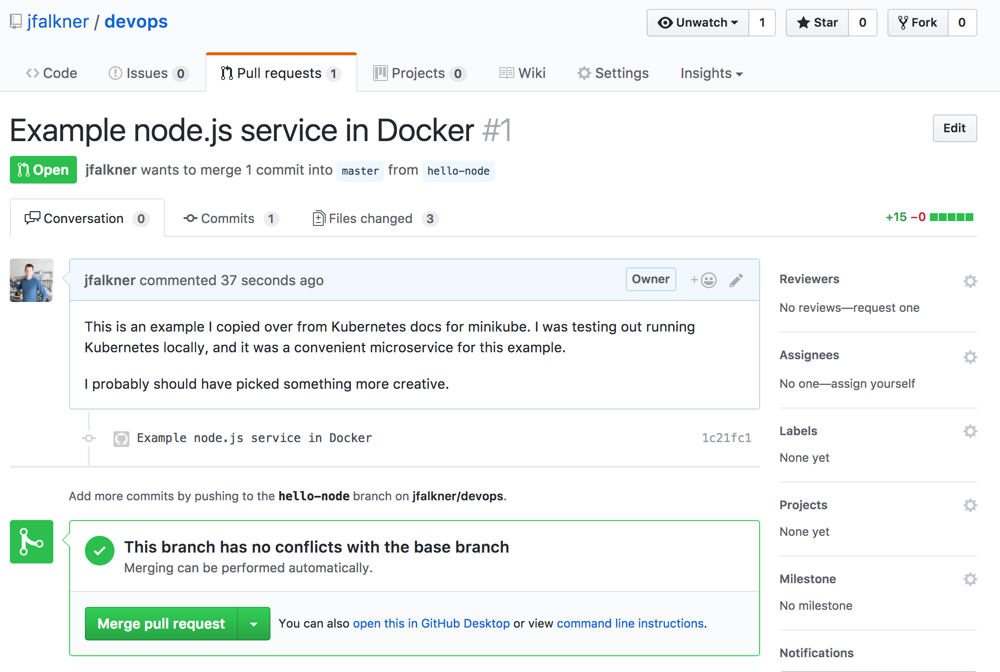
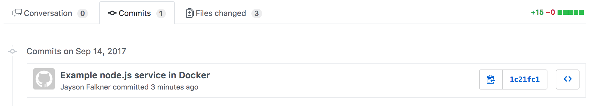
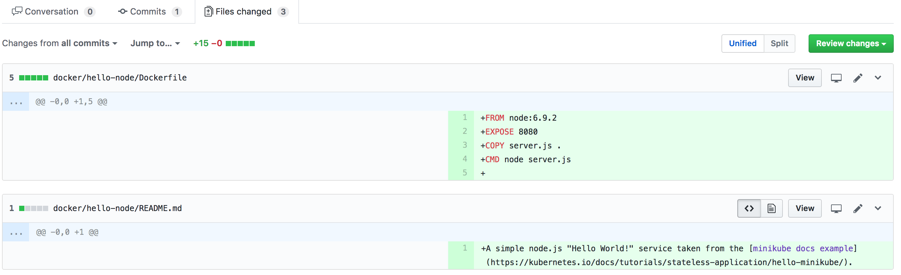

# Devops That Work Well

> Work-in-Progress. Mostly for my own use right now.

Brief overview of streamlining software developer operations. Written by someone who has managed several engineering teams at several different companies. The intended style is to cover a lot but keep it succinct. You should know this stuff, and hopefully have management that values it.

Why care? A good, scalable devops stack saves the entire team time. It reduces maintenance time dramatically. It also designs away many scalability issues and team/org failure modes. You don't need a dedicated "devops" team to do this right.

At really high level, here is how it works:

* Track all code changes in [git](https://git-scm.com/) and review in [GitHub](https://github.com/)
* Isolate code and reproducibly run it via [Docker](https://www.docker.com/) in a scalable way on servers with [Kubernetes](https://kubernetes.io/docs/home/) and use Helm to version entire rollouts of services and jobs.
* Auto-test code updates and continuously deploy with CircleCI. Prototype with feature flags in [Launch Darkly](https://launchdarkly.com/)
* Stash secrets in [Vault](https://www.vaultproject.io/)

When setup well, the entire team focuses on coding, reviewing code and communicating. Exactly what everyone wants.

## git and GitHub

Foundation pieces of many developer groups. `git` is very popular but is just one of many [version control](https://en.wikipedia.org/wiki/Version_control) tools used historically. It is used to track who made what change when for all edits to the software's source files. Also allows for making many simultaneous changes and merging them together. Invaluable tool for coordinating work, and incredible for auditing who did what.

GitHub (aka GH) adds a lot of functionality for team-based work, primarily visualizing and enabling code review; however, it also has many integrations for automatically doing all sorts of useful tedium that benefits teams. GH also gets in to some project management with issues, projects and Kanban-style tickets management. 

> Tip: If you don't know better, just use `git` and GitHub. Don't bother with other stuff (i.e. don't default to Bitbucket and Bamboo just because some non-developer in your org bought Atlassian's JIRA).

Here are some examples of git. Not always command-line, but that is what many prefer.

```
# copy the history of all edits of this content and code (aka repo)
git clone https://github.com/jfalkner/devops.git

# inspect history of change. who, when, what
git log
# commit 46cdfff2f986196388f066c13676a7b07c98cedc
# Author: Jayson Falkner <jfalkner@gmail.com>
# Date:   Thu Sep 14 22:10:28 2017 -0400
#
#    Initial Docker summary
# ...

# make a branch named 'hello-node' so changes can be reviewed before they clobber production code
git branch hello-node

# add some new files
git add docker

# see what was added/changed compared to what is in the repo
git status
# On branch hello-node
# Your branch is up-to-date with 'origin/master'.
# Changes to be committed:
#
# new file:   docker/hello-node/Dockerfile
#	new file:   docker/hello-node/README.md
#	new file:   docker/hello-node/server.js

# make the changes and push to the repo hosted on GitHub
git commit -m "Example node.js service in Docker"
git push origin hello-node
```

And on GitHub you can see the changes in a Pull Request (aka PR). 



Which let's you also see the commit history. It is usually expected that commits are a meaningful, logical history of changes.



> Tip: If hiring, check the dev's GitHub profile. Nice if they have one. Better if each project makes sense has well done README.md. Best if there are well done "squashed" commits with good descriptions. Good devs usually take pride in their work and polish up commit history for posterity.

PRs also show code changes. The view lets others leave comments and reviews in specific locations of interst. Fantastic for preventing bugs, mentoring, making sure others know what is changing and continuous learning for team members.



> Tip: Healthy teams usually enjoy PR review and have at least one other dev, if not several look over changes. It is perhaps the most enjoyable part of day-to-day coding.

> Tip: PR review is a great spot to watch for [bike shedding](http://whatis.techtarget.com/definition/Parkinsons-law-of-triviality-bikeshedding) and inappropriate [no asshole rule](https://en.wikipedia.org/wiki/The_No_Asshole_Rule) activity. In both cases, course correct or remove offending devs before they tank an otherwise healthy team.

There is a lot of more advanced GitHub usage, including an amazing API. Above is just a very light intro to the core stuff.

## Docker

[Docker](https://docs.docker.com/engine/) let's you wrap up both code and dependencies and run them as a "container" on the same computer. It is a fast and easy way to reliably run different software on the same computer. It mainly works by resource isolation. Same kernel but mem usage, CPU, threads, can't interfere with each other. Great summary on [wikipedia](https://en.wikipedia.org/wiki/Docker_(software)) and [history here](https://blog.aquasec.com/a-brief-history-of-containers-from-1970s-chroot-to-docker-2016) since this idea is an old one.

In practice, you make a file named `Dockerfile` that describes a base Linux OS plus stuff to install or configure. You use `docker` commands to build images that can be deployed an run. [Docker hub](https://hub.docker.com/) has many pre-made images exist for common stuff like dbs, message brokers, etc. It works on OSX (i.e. your Macbook Pro) by running Linux in a VM locally then using that kernel for Docker images.

Why do this?

* It avoids [dependency hell](https://en.wikipedia.org/wiki/Dependency_hell). You don't have to care if two parts of the software rely different packages. You also don't have to care if installing some needed binary messes with the OS.

* You don't have to code everything in exactly one language. Nor in one really big application. Nor get it perfect the first time around. Microservices are nice. Scope something to the size that can be rewritten by one or two people sub-week. It is then no big deal to prototype or let folks try newer tools and languages.

* It makes it easy to package up an entire software project in one place, including as a simple tarball. Key to making sure you can both test and recreate the exact setup needed to run software.

Below are some examples of usage.

```
# make a Docker image based on the Dockerfile (see docker/hello-node)
cd docker/hello-node
docker build -t hello-node/v1 .

# check to see that `hello-node/v1` exists -- a linux server with node.js installed on it
docker images
# REPOSITORY          TAG                 IMAGE ID            CREATED             SIZE
# hello-node/v1       latest              f35a041887c9        27 minutes ago      655MB

# run the node server, which will appear on http://localhost:8080
docker run --rm hello-node/v1 node sever.js

# (optional) attach to see stdout for a running container
docker container ls
docker container attach 4bad9a6e7525 # container's id

# drop the image from your local store when it is no longer needed
docker rmi f35a041887c9
```
